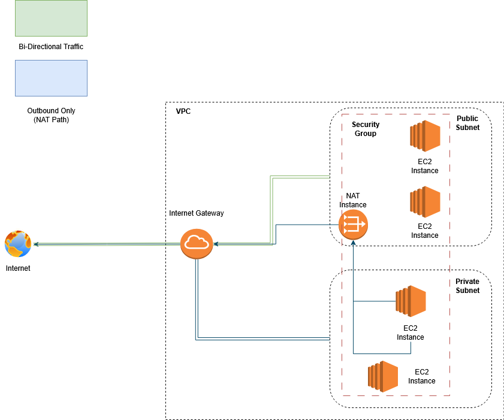
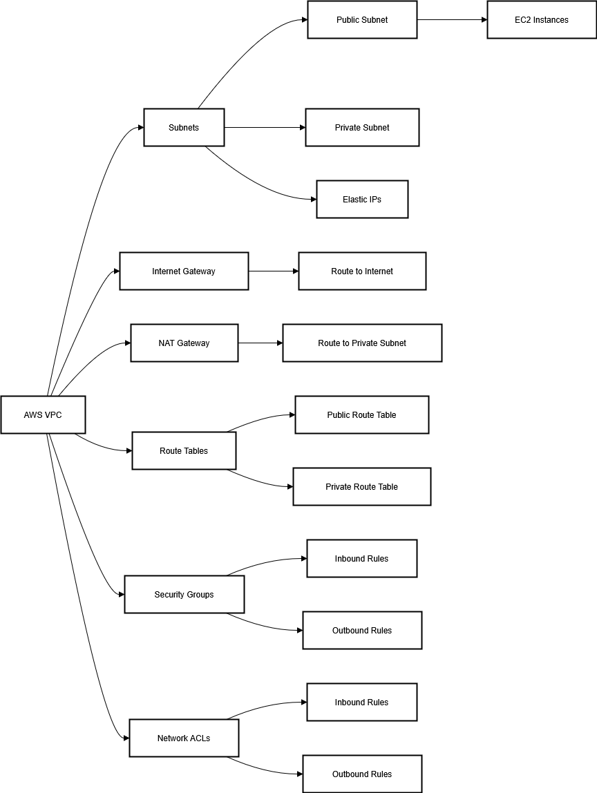

# 🌄 Project Overview

This project builds off of an AWS built-from-scratch VPC project that can be investigated at either of these links, this will be particularly relevant for things like installing WSL (Windows Subsystem for Linux), AWS CLI configuration, etc.:


It includes the following sections:

- Project Overview
- Process & Steps
- Post Exercise Reflections


# ⚙️ Tools & Technologies

- AWS Console
  - GUI for simple interactions with AWS

- AWS CLI
  - Granular AWS interactions via terminal

- WSL (Window Subsystem for Linux)
  - A linux environment nested in Windows 

- Git / Github
  - Local and online version control and repository

- Visual Studio Code
  - Text and code editing

- Python Virtual Environment
	- Self-contained Python setup

# 📜 Diagrams





# 🏗️ Design Rationale

The intent with this project was to recreate the prior project while utilizing boto3 and python instead
of the bash scripting language. 

That project created a VPC that resembled a professional network using the AWS free tier.

# 🔧 Setup

## Prerequisites

### Download and Install Python 3

- Go to https://www.python.org/downloads/
- Left click “Download Python 3.X.X”
- Run the installer
- Check the box that says:
“Add Python 3.x to PATH”
- Click “Install Now” (recommended).
- The installer will set up Python and pip (Python’s package manager).
- Once it finishes, you’ll see a “Setup was successful” message.

- To verify Python installed correctly, open your command prompt and type:

```bash
python -–version
```
or 

```bash
python3 -–version  
```

if you see “Python 3.X.X” it was set up successfully.

- For pip, once again in the command prompt, type: 

```bash
pip -–version  
```

and look for 
a similar response to verify a successfully set up.

### Create a Python Virtual Environment

- Install python3 virtual environment using:

```bash
sudo apt install python3-env
```

- Then type the following command:

```bash 
python3 -m venv ~/.venvs/cloud-scripts
```

### Activate the Environment

- Input the command: 

```bash
source ~/.venvs/cloud-scripts/bin/activate
```

### Install boto3

- In the command line, type:

```bash 
pip install boto3
```

### Optional: Auto-activate for convenience

- Edit your .bashrc file. Type:

```bash 
nano ~/.bashrc
```

This will open the nano word editor inside of your shell.

- Using the arrow keys, scroll down to the bottom of the .bashrc file
and input:

```bash
source ~/.venvs/cloud-scripts/bin/activate
```

- Reload the shell using:

```bash
source ~/.bashrc
```

This will make it so that the python3 virtual environment will automatically open upon starting your bash shell. If you want to prevent this from happening, simply open the file and remove “source ~/.venvs/cloud-scripts/bin/activate”. 

If you’d like to exit the virtual environment temporarily, but keep the auto-activation on shell start-up, type:

```bash
deactivate
```

Now you’re ready to start using python scripts via boto3.

# Interacting with AWS VPC via Python and boto3

You should be able to reuse a lot of what was already built in project 1, but you may have deleted some components. If you see you are missing necessary components, consult project 1 for their recreation. That said, we will still repeat a few of the steps from the last project in Python.

## Getting the latest Linux AMI with Python and boto3

We’re getting to the get ID of the latest AMI first, and then use that ID to create a new EC2 instance. Copy the command below:

```bash
import boto3

def get_amazon_linux_2_ami():
	ec2 = boto3.client('ec2')

	response = ec2.describe_images(
    	Owners=['amazon'],
    	Filters=[
        	{'Name': 'name', 'Values': ['amzn2-ami-hvm-*-x86_64-gp2']},
        	{'Name': 'state', 'Values': ['available']},
        	{'Name': 'architecture', 'Values': ['x86_64']},
        	{'Name': 'root-device-type', 'Values': ['ebs']},
        	{'Name': 'virtualization-type', 'Values': ['hvm']}
    	]
	)

	# Sort by CreationDate descending to get the latest one
	images = sorted(response['Images'], key=lambda x: x['CreationDate'], reverse=True)
	latest_ami = images[0]
	print(f"Latest Amazon Linux 2 AMI ID: {latest_ami['ImageId']}")
	print(f"Name: {latest_ami['Name']}")
	print(f"Creation Date: {latest_ami['CreationDate']}")

if __name__ == "__main__":
	get_amazon_linux_2_ami()
```

Now, in your ubuntu shell type:

```bash
nano get_ami_latest.py
```

this will open up the editor in the shell. This command is rather long, so we’re going to make a text file and then just run that text file using python.

Once you’ve got the command pasted into the file using nano, press “Ctrl + X” to exit the editor and make sure to press “Y” when it asks if you’d like to save your changes. 

Run the script using:

```bash
python3 get_ami_latest.py
```

Copy the ID, which should resemble: “ami-0ddac208607ae06a0”

If you already had an AMI ID saved from the last project and did that recently, you can also just use that.

Now we’re going to set up an EC2 instance in the Python syntax.

## Creating an EC2 instance using Python and boto3

We’ll now create the EC2 instance using a command that will be listed below. The AMI_ID value is real, but may be old upon the time of reading. The INSTANCE_TYPE is correct, but the other 3 values will need to be adjusted. Insert the proper values for KEY_NAME, SECURITY_GROUP_IDS, and SUBNET_ID.

Type:

```bash
nano create_ec2_instance.py
```

to open an empty text file. When we create these files it not only makes it a bit more manageable to see what you’re working with, it also saves the script in your folder for later use.

Paste the following: 

```bash
import boto3

# Replace these with your real values
AMI_ID = ‘ami-0ddac208607ae06a0’
INSTANCE_TYPE = 't2.micro'
KEY_NAME = ‘key-pair-xx’
SECURITY_GROUP_IDS = ['sg-123456789']  # Must exist in your VPC
SUBNET_ID = 'subnet-123456789'   # Must be public if you want external access


def launch_instance():
	ec2 = boto3.client('ec2')

	response = ec2.run_instances(
    	ImageId=AMI_ID,
    	InstanceType=INSTANCE_TYPE,
    	KeyName=KEY_NAME,
    	MaxCount=1,
    	MinCount=1,
    	SecurityGroupIds=SECURITY_GROUP_IDS,
    	SubnetId=SUBNET_ID,
    	TagSpecifications=[
        	{
            	'ResourceType': 'instance',
            	'Tags': [
                	{'Key': 'Name', 'Value': 'Boto3-Launched-Instance'},
            	]
        	}
    	]
	)

	instance_id = response['Instances'][0]['InstanceId']
	print(f"Launched instance with ID: {instance_id}")

if __name__ == "__main__":
	launch_instance()
```

## Stopping an EC2 instance and creating more reusable scripts 

In the last project, we established that stopping unused resources is critical for cost savings, but stopping unused resources isn’t the only way we can be more efficient. We also reuse resources, and that’s what we’re going to do with the next script. 

We’ll continue using Python and boto3, but we’ll also use another library in addition to boto3, called ‘argparse’.

By using argparse, what we’re doing is allowing dynamic entry of values like: AMI_ID, INSTANCE_TYPE, KEY_NAME, SECURITY_GROUP_IDS, and SUBNET_ID. Instead of hardcoding those values into the text file, you’ll be able to enter them directly at the terminal line as needed. 

In this case, though, the only value for this script will be the INSTANCE_ID.

Just like last time, we’ll use nano to create a text file for the script, type:

```bash
nano stop_ec2.py
```

Then paste the following:

```bash
#!/usr/bin/env python3

import boto3
import argparse

def stop_instance(instance_id):
	ec2 = boto3.client('ec2')

	try:
    	response = ec2.stop_instances(InstanceIds=[instance_id])
    	current_state = response['StoppingInstances'][0]['CurrentState']['Name']
    	print(f"Instance {instance_id} is now {current_state}.")
	except Exception as e:
    	print(f"Error stopping instance: {e}")

if __name__ == "__main__":
	parser = argparse.ArgumentParser(description="Stop an EC2 instance by ID")
	parser.add_argument('--instance-id', required=True, help='The ID of the EC2 instance to stop')

	args = parser.parse_args()
	stop_instance(args.instance_id)
```

Now that you have the script saved, you just need to change the permissions to make it executable using:

```bash
chmod +x stop_ec2.py
```

Once you’ve done that, you can stop the instance using:

```bash
./stop_ec2.py --instance-id i-0abcdef1234567890
```

## Making a management script with multiple actions

Building on what we’ve just done, we can make a singular script, which we’ll call manage_ec2.py, that will allow us to start, stop, or terminate an EC2 instance based on the flags that we put into the command line. 

Type:

```bash
nano manage_ec2.py
```

Paste in the following:

```bash
#!/usr/bin/env python3

import boto3
import argparse
import sys

def start_instance(ec2, instance_id):
	try:
    	response = ec2.start_instances(InstanceIds=[instance_id])
    	state = response['StartingInstances'][0]['CurrentState']['Name']
    	print(f"✅ Instance {instance_id} is now {state}.")
	except Exception as e:
    	print(f"❌ Error starting instance: {e}")

def stop_instance(ec2, instance_id):
	try:
    	response = ec2.stop_instances(InstanceIds=[instance_id])
    	state = response['StoppingInstances'][0]['CurrentState']['Name']
    	print(f"🛑 Instance {instance_id} is now {state}.")
	except Exception as e:
    	print(f"❌ Error stopping instance: {e}")

def terminate_instance(ec2, instance_id):
	try:
    	response = ec2.terminate_instances(InstanceIds=[instance_id])
    	state = response['TerminatingInstances'][0]['CurrentState']['Name']
    	print(f"💀 Instance {instance_id} is now {state}.")
	except Exception as e:
    	print(f"❌ Error terminating instance: {e}")

def main():
	parser = argparse.ArgumentParser(description="Manage EC2 instances with start, stop, or terminate")
	parser.add_argument('--action', choices=['start', 'stop', 'terminate'], required=True, help="Action to take")
	parser.add_argument('--instance-id', required=True, help="EC2 instance ID")

	args = parser.parse_args()

	ec2 = boto3.client('ec2')

	if args.action == 'start':
    	start_instance(ec2, args.instance_id)
	elif args.action == 'stop':
    	stop_instance(ec2, args.instance_id)
	elif args.action == 'terminate':
    	terminate_instance(ec2, args.instance_id)
	else:
    	print("❌ Invalid action.")
    	sys.exit(1)

if __name__ == "__main__":
	main()
```

Save the file

and now make it executable with the following command: 

```bash
chmod +x manage_ec2.py
```

Example usage:

```bash
./manage-ec2.py --action stop --instance-id i-0123456789abcdef0
./manage-ec2.py --action start --instance-id i-0123456789abcdef0
./manage-ec2.py --action terminate --instance-id i-0123456789abcdef0
```

## Adding a listing command and logging to a file

Our manage_ec2.py script is actually capable of scaling and new features. A lot of them. We’ll keep it simple for now, however, and only add a few.

Due to some awkward nano limitations and for the sake of simplicity, we’re just going to delete the old manage_ec2.py file. Type:

```bash
rm manage_ec2.py
```

We’ll now create a new manage_ec2.py script, but we’ll now have both a logging feature and the ability to list instances. Type:


```bash
nano manage_ec2.py
```

and now paste the following into the file:

```bash

#!/usr/bin/env python3

import boto3
import argparse
import sys
import logging

# Setup logging
logging.basicConfig(
    filename='ec2_manager.log',
    level=logging.INFO,
    format='%(asctime)s - %(levelname)s - %(message)s'
)

def start_instance(ec2, instance_id):
    try:
        response = ec2.start_instances(InstanceIds=[instance_id])
        state = response['StartingInstances'][0]['CurrentState']['Name']
        print(f"✅ Instance {instance_id} is now {state}.")
        logging.info(f"Started instance: {instance_id}, now {state}")
    except Exception as e:
        print(f"❌ Error starting instance: {e}")
        logging.error(f"Error starting instance {instance_id}: {e}")

def stop_instance(ec2, instance_id):
    try:
        response = ec2.stop_instances(InstanceIds=[instance_id])
        state = response['StoppingInstances'][0]['CurrentState']['Name']
        print(f"🛑 Instance {instance_id} is now {state}.")
        logging.info(f"Stopped instance: {instance_id}, now {state}")
    except Exception as e:
        print(f"❌ Error stopping instance: {e}")
        logging.error(f"Error stopping instance {instance_id}: {e}")

def terminate_instance(ec2, instance_id):
    try:
        response = ec2.terminate_instances(InstanceIds=[instance_id])
        state = response['TerminatingInstances'][0]['CurrentState']['Name']
        print(f"💀 Instance {instance_id} is now {state}.")
        logging.info(f"Terminated instance: {instance_id}, now {state}")
    except Exception as e:
        print(f"❌ Error terminating instance: {e}")
        logging.error(f"Error terminating instance {instance_id}: {e}")

def list_instances(ec2):
    try:
        response = ec2.describe_instances()
        for reservation in response['Reservations']:
            for instance in reservation['Instances']:
                instance_id = instance['InstanceId']
                state = instance['State']['Name']
                name = next(
                    (tag['Value'] for tag in instance.get('Tags', []) if tag['Key'] == 'Name'),
                    'Unnamed'
                )
                print(f"{instance_id} | {state} | {name}")
        logging.info("Listed instances successfully.")
    except Exception as e:
        print(f"❌ Error listing instances: {e}")
        logging.error(f"Error listing instances: {e}")

def main():
    parser = argparse.ArgumentParser(description="Manage EC2 instances: start, stop, terminate, list")
    parser.add_argument('--action', choices=['start', 'stop', 'terminate', 'list'], required=True, help="Action to take")
    parser.add_argument('--instance-id', help="EC2 instance ID (not required for 'list')")

    args = parser.parse_args()
    ec2 = boto3.client('ec2')

    if args.action == 'start':
        if not args.instance_id:
            print("❗️ --instance-id is required for 'start'")
            return
        start_instance(ec2, args.instance_id)

    elif args.action == 'stop':
        if not args.instance_id:
            print("❗️ --instance-id is required for 'stop'")
            return
        stop_instance(ec2, args.instance_id)

    elif args.action == 'terminate':
        if not args.instance_id:
            print("❗️ --instance-id is required for 'terminate'")
            return
        terminate_instance(ec2, args.instance_id)

    elif args.action == 'list':
        list_instances(ec2)

    else:
        print("❌ Invalid action.")
        sys.exit(1)

if __name__ == "__main__":
    main()
```

Once again, make it executable with the following:

```bash
chmode +x manage_ec2.py
```

You can now use the contents of the manage_ec2.py file to do the following:

*List all EC2 instances*:
./manage_ec2.py --action list

*Stop an EC2 instance by ID*:
./manage_ec2.py --action stop --instance-id i-0123456789abcdef0

*Check logs*:
cat ec2_manager.log

# 🤔 Reflections

Recreating the same logic in a different language emphasized the value of abstracting ideas into general systems and using available tools and documentation to implement them efficiently.

